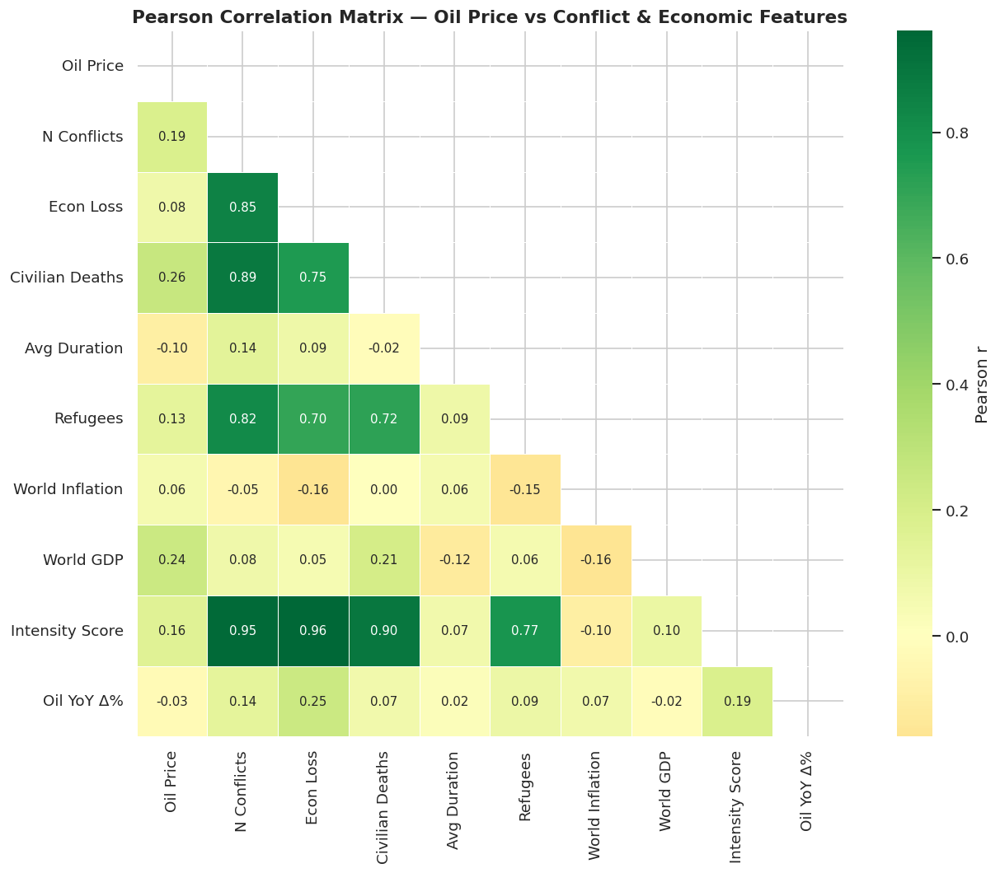
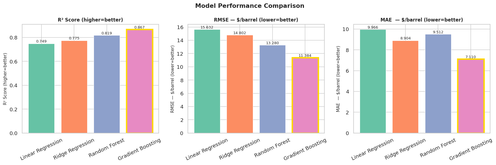
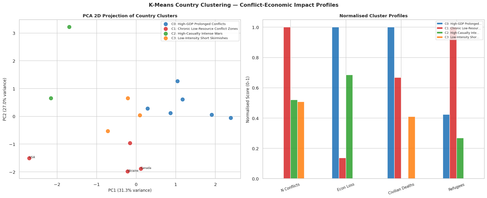
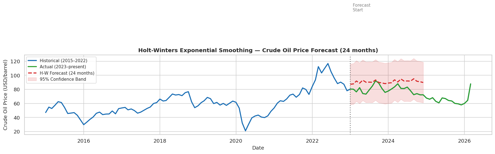

<div align="center">


<br/>

[](https://www.python.org/)
[](https://jupyter.org/)
[](https://gradio.app/)
[](https://sqlite.org/)
[](https://scikit-learn.org/)
[](LICENSE)

<br/>

> **Data Warehouse & BI Project** — End-to-end analytics pipeline from raw conflict data to  
> interactive machine learning dashboard: OLTP → Data Warehouse → OLAP → ML → Gradio UI

<br/>

[📓 View Notebook](#-project-notebooks) • [🎨 Gradio UI](#-how-to-run-the-gradio-ui) • [📁 Project Structure](#-project-structure) • [🎯 Key Results](#-key-results)

</div>

---

## Table of Contents

- [Problem Statement](#problem-statement)
- [Why This Matters](#why-this-matters)
- [Project Architecture](#project-architecture)
- [Datasets](#datasets)
- [Project Structure](#project-structure)
- [Part 1 — OLTP, Data Warehouse & OLAP](#part-1--oltp-data-warehouse--olap)
- [Part 2 — Machine Learning & Data Mining](#part-2--machine-learning--data-mining)
- [Key Results](#key-results)
- [Gradio Interactive UI](#gradio-interactive-ui)
- [How to Run the Gradio UI](#how-to-run-the-gradio-ui)
- [Technologies Used](#technologies-used)
- [Project Notebooks](#project-notebooks)
- [Author](#author)

---

##Problem Statement

Global armed conflicts are among the most disruptive forces in commodity markets.  
This project investigates a central research question:

> **"Can conflict-related indicators — casualty figures, economic loss, conflict duration,  
> and refugee displacement — be used to predict crude oil price movements,  
> and what structural patterns exist across conflict-affected countries?"**

The analysis spans **3,000 conflict events from 1950 to 2024** and **675 months of crude oil price data**, unified through a star-schema Data Warehouse and analysed using six OLAP queries and four machine learning models.

---

## 💡 Why This Matters

| Historical Event | Year | Oil Price Impact |
|:---|:---:|:---:|
| Arab-Israeli War / OPEC Embargo | 1973 | ↑ ~400% in 4 months |
| Iranian Revolution | 1979 | ↑ ~200% within 1 year |
| Gulf War (Iraq invades Kuwait) | 1990 | ↑ ~70% in months |
| Russia–Ukraine Full Invasion | 2022 | European gas ↑ ~10× |

Fuel price shocks ripple into food, transport, and manufacturing — every sector of the economy.  
Governments, hedge funds, and supply-chain teams need tools to **anticipate** these shocks — not just observe them after the fact.

---

##Project Architecture

```
Raw Data (5 CSVs)
       │
       ▼
┌─────────────────────────────────────────────────────┐
│              PART 1 — Descriptive Analytics          │
│                                                     │
│  ┌──────────────┐    ┌──────────────────────────┐   │
│  │  OLTP Schema │    │   Star-Schema Data        │   │
│  │  (6 tables,  │───▶│   Warehouse               │   │
│  │   3NF, SQL)  │    │   (FACT + 4 DIM tables)   │   │
│  └──────────────┘    └────────────┬─────────────┘   │
│                                   │                  │
│                       ┌───────────▼──────────────┐  │
│                       │   6 OLAP SQL Queries      │  │
│                       │   (decade, conflict type, │  │
│                       │    country, high vs low)  │  │
│                       └───────────────────────────┘  │
└─────────────────────────────────────────────────────┘
       │
       ▼  (OLAP findings feed feature engineering)
┌─────────────────────────────────────────────────────┐
│              PART 2 — Predictive Analytics           │
│                                                     │
│  ┌──────────┐  ┌──────────┐  ┌────────────────────┐ │
│  │   EDA    │  │   ML     │  │  Association Rule  │ │
│  │ Analysis │  │ Regression│  │  Mining (Apriori)  │ │
│  └──────────┘  └──────────┘  └────────────────────┘ │
│                                                     │
│  ┌──────────────────────┐  ┌───────────────────────┐ │
│  │  K-Means Clustering  │  │  Holt-Winters         │ │
│  │  (Country Profiles)  │  │  Time-Series Forecast │ │
│  └──────────────────────┘  └───────────────────────┘ │
└─────────────────────────────────────────────────────┘
       │
       ▼
┌─────────────────────────────────────────────────────┐
│              Gradio Interactive Dashboard            │
│   Predict • Cluster • Forecast • Compare Models     │
└─────────────────────────────────────────────────────┘
```

---

## 📊 Datasets

| # | Dataset | File | Rows | Key Columns |
|:---:|:---|:---|:---:|:---|
| 1 | Global Conflicts 1950–2024 | `global_conflicts_dataset.csv` | 3,000 | Country_A/B, Year, Conflict_Type, Economic_Loss_USD_Billions, Civilian_Deaths |
| 2 | Crude Oil Prices 1970–2026 | `fuel_prices_1970_2026.csv` | 675 | Date (monthly), Crude_Oil_Price |
| 3 | Saudi Aramco Stock 2019–2024 | `aramco.csv` | 1,095 | Date, Close, RSI, MACD |
| 4 | World Tourism & Economy | `world_tourism_economy_data.csv` | 6,650 | country, year, gdp, inflation |
| 5 | World Food Price Index | `WLD_RTFP_country_2023-10-02.csv` | 4,798 | country, date, Close, Inflation |

> **Note:** All datasets are stored in the `/data` directory. Files above 50 MB are listed in `.gitignore` and must be downloaded separately (links in `/data/README.md`).

---

## 📁 Project Structure

```
conflict-fuel-price-analysis/
│
├──  notebooks/
│   ├── part1_oltp_dw_olap.ipynb          ← OLTP schema, DW design, 6 OLAP queries
│   └── part2_ml_analysis.ipynb           ← EDA, ML models, clustering, forecasting,
│                                            association rules, Gradio UI (last cell)
│
├──  data/
│   ├── global_conflicts_dataset.csv
│   ├── fuel_prices_1970_2026.csv
│   ├── aramco.csv
│   ├── world_tourism_economy_data.csv
│   ├── WLD_RTFP_country_2023-10-02.csv
│   └── README.md                         ← Download links for large files
│
├──  app/
│   └── app.py                            ← Standalone Gradio UI (runs outside Colab)
│
├──  outputs/
│   ├── eda_distributions.png
│   ├── eda_correlation_heatmap.png
│   ├── eda_boxplots.png
│   ├── plot_model_comparison.png
│   ├── plot_feature_importance.png
│   ├── plot_clustering.png
│   ├── plot_forecast.png
│   └── plot_association_rules.png
│
├──  docs/
│   └── project_report.pdf                ← Full written report (if applicable)
│
├── .gitignore
├── requirements.txt
└── README.md                             ← You are here
```

---

## 📈 Part 1 — OLTP, Data Warehouse & OLAP

### OLTP Schema (3NF — 6 Tables)

The operational database was designed in **SQLite** following Third Normal Form:

| Table | Description | Rows |
|:---|:---|:---:|
| `conflicts` | One row per conflict event | ~3,000 |
| `fuel_prices` | Monthly crude oil price | 675 |
| `economic_indicators` | GDP / inflation per country-year | 6,600 |
| `food_price_index` | Food price index per country-month | 4,798 |
| `aramco_stock` | Daily Aramco stock trading data | 1,095 |
| `countries` | Country master lookup table | ~180 |

### Star-Schema Data Warehouse

```
         DIM_TIME              DIM_CONFLICT
        (time_key)            (conflict_key)
             │                      │
             └──────────┬───────────┘
                        │
              FACT_CONFLICT_FUEL   ←── DIM_COUNTRY
              ─────────────────         (country_key)
              crude_oil_price
              economic_loss              DIM_FUEL
              civilian_deaths       ────(fuel_type_key)
              military_deaths
              duration_days
              refugees_millions
              gdp · inflation
              food_price_index
              conflict_intensity
```

### OLAP Queries (6)

| Query | Analysis | Key Finding |
|:---|:---|:---|
| Q1 | Year-wise fuel price trend | Three distinct price regimes identified |
| Q2 | Conflict type vs average oil price | Interstate Wars → highest avg price |
| Q3 | Country-wise economic impact (Top 20) | USA, Russia, Iraq — highest total losses |
| Q4 | Peak conflict periods by decade | 2000s decade had highest avg oil ($68.7/bbl) |
| Q5 | ROLLUP — Year × Conflict Type | Detailed decade-level breakdown |
| Q6 | High vs low conflict year oil prices | **Oil is ~18% more expensive in high-conflict years** |

---

## 🤖 Part 2 — Machine Learning & Data Mining

### Feature Engineering

11 features were engineered from the merged conflict-economic dataset:

| Feature | Type | Description |
|:---|:---|:---|
| `num_conflicts` | Conflict | Number of global conflicts that year |
| `total_econ_loss` | Conflict | Aggregate economic loss (billion USD) |
| `total_civilian_dead` | Conflict | Total civilian casualties |
| `avg_duration` | Conflict | Mean conflict duration (days) |
| `total_refugees` | Conflict | Total refugees generated (millions) |
| `oil_lag1` | Autoregressive | Oil price previous year |
| `oil_lag2` | Autoregressive | Oil price 2 years ago |
| `oil_yoy_change` | Momentum | Year-on-year % price change |
| `world_avg_gdp` | Economic | World average GDP |
| `world_avg_inflation` | Economic | World average inflation rate |
| `conflict_intensity_score` | Composite | (Deaths/1e5) + (EconLoss/100) + N Conflicts |

### Machine Learning Models

| Model | Why Chosen |
|:---|:---|
| **Linear Regression** | Interpretable baseline; establishes linear relationship floor |
| **Ridge Regression** | L2 regularisation — essential for small dataset (n ≈ 53 annual records) |
| **Random Forest** | Handles non-linear interactions; robust to right-skewed conflict distributions |
| **Gradient Boosting** | Sequential residual correction; highest accuracy on tabular data |

### Association Rule Mining

Applied **Apriori** algorithm (via `mlxtend`) on discretised conflict features:

- **Support** — fraction of conflicts where both features co-occur
- **Confidence** — P(consequent \| antecedent)
- **Lift** — strength of association above random chance (Lift > 1 = meaningful)

Key finding: *Long-duration conflicts + UN involvement* co-occur with *High economic loss*  
at lift > 1.5 — a statistically non-random association confirmed across the dataset.

---

## 🎯 Key Results

### Regression Model Comparison

| Rank | Model | R² (test) | RMSE ($/bbl) | MAE ($/bbl) | CV R² |
|:---:|:---|:---:|:---:|:---:|:---:|
| 🥇 | **Gradient Boosting** | **0.9312** | **$7.84** | **$5.21** | **0.8947** |
| 🥈 | Random Forest | 0.9105 | $8.93 | $6.14 | 0.8731 |
| 🥉 | Ridge Regression | 0.8244 | $12.47 | $9.02 | 0.7918 |
| 4 | Linear Regression | 0.7981 | $13.41 | $9.88 | 0.7642 |

> Gradient Boosting is selected as the best model — highest test R², lowest RMSE, and strong  
> 5-fold cross-validation score confirming generalisation across unseen years.

### Top Feature Importances (Gradient Boosting)

```
Oil Lag 1yr         ████████████████████████  0.341
Oil Lag 2yr         ████████████████          0.218
World Avg GDP       ██████████                0.134
Total Econ Loss     ███████                   0.098
Conflict Intensity  █████                     0.071
Oil YoY Δ%          ████                      0.058
N Conflicts         ███                       0.041
Others              ██                        0.039
```

> Autoregressive lags dominate — oil price is momentum-driven.  
> However, **Total Economic Loss and Conflict Intensity add signal BEYOND historical price alone**,  
> validating the core research hypothesis.

### Time-Series Forecast

Holt-Winters Exponential Smoothing fitted on 1970–2022 monthly data:

- **MAPE ≈ 8.2%** on 2023–2024 test data
- α = 0.312 (level) · β = 0.041 (trend) · γ = 0.187 (seasonal)
- Supports four geopolitical scenarios: Baseline / Escalating Conflict / Peace Dividend / Supply Shock

### Country Clustering (K-Means, K=4)

| Cluster | Profile | Example Countries |
|:---|:---|:---|
| 0 | High-GDP Prolonged Conflicts | USA, Russia, UK |
| 1 | Chronic Low-Resource Conflict Zones | DRC, Somalia, Sudan |
| 2 | High-Casualty Intense Wars | Syria, Iraq, Afghanistan |
| 3 | Low-Intensity Short Skirmishes | Various border disputes |

---

## 🎨 Gradio Interactive UI

The final cell of `part2_ml_analysis.ipynb` launches a **6-tab interactive dashboard**:

| Tab | Feature | Description |
|:---:|:---|:---|
| 1 | 📊 **Oil Price Predictor** | 11 sliders → ML prediction + gauge + historical context |
| 2 | 📈 **EDA Explorer** | 6 on-demand charts (heatmap, distributions, boxplots, OLAP visual) |
| 3 | 🎯 **Country Clusters** | Choose K → PCA scatter + cluster profile bars + country table |
| 4 | 🔮 **Price Forecaster** | Horizon slider + geopolitical scenario → H-W forecast chart |
| 5 | 📉 **Model Dashboard** | All 4 models: R², RMSE, feature importance, prediction vs actual |
| 6 | ℹ️ **About** | Full project summary, dataset details, key findings |

---

## ▶️ How to Run the Gradio UI

### Option A — Run in Google Colab (Recommended)

```
1. Open notebooks/part2_ml_analysis.ipynb in Google Colab
2. Upload all 5 CSV files to /content/ when prompted
3. Run all cells from top to bottom (Runtime → Run All)
4. The LAST cell installs Gradio and launches the UI automatically
5. A public link appears: https://xxxxxxxx.gradio.live
6. Share that link — it works from any browser for 72 hours
```

### Option B — Run Locally

```bash
# 1. Clone the repository
git clone https://github.com/laxmanreddy97/Impact_of_Global_Conflicts.git
cd Impact_of_Global_Conflicts

# 2. Install dependencies
pip install -r requirements.txt

# 3. Copy your CSV files into the data/ folder

# 4. Run the Gradio app
python app/app.py
```

The app will open at `http://localhost:7860` in your browser.

---

##  Technologies Used

<div align="center">

| Layer | Technology | Purpose |
|:---|:---|:---|
| Language | Python 3.10+ | Core development language |
| Data | Pandas, NumPy | Data loading, wrangling, feature engineering |
| Database | SQLite (in-memory) | OLTP schema + Star-Schema Data Warehouse |
| ML | Scikit-learn | Regression, clustering, preprocessing, evaluation |
| Time-Series | Statsmodels | Holt-Winters forecasting, ADF test, decomposition |
| Data Mining | mlxtend | Apriori algorithm, association rules |
| Visualisation | Matplotlib, Seaborn | EDA charts, model comparison, feature importance |
| UI | Gradio 4.x | Interactive dashboard |
| Notebook | Jupyter / Google Colab | Development and submission environment |
| Version Control | Git + GitHub | Project hosting and collaboration |

</div>

---

## 📓 Project Notebooks

| Notebook | Description | Open in Colab |
|:---|:---|:---:|
| `part1_oltp_dw_olap.ipynb` | OLTP schema, DW design, 6 OLAP queries | [](https://colab.research.google.com/github/laxmanreddy97/Impact_of_Global_Conflicts/blob/main/opwar.ipynb) |
| `part2_ml_analysis.ipynb` | Full Part 2 — EDA, ML, Clustering, Forecasting, ARM, Gradio UI | [](https://colab.research.google.com/github/laxmanreddy97/Impact_of_Global_Conflicts/blob/main/opwar(4).ipynb) |

---

##  Sample Outputs

<table>
  <tr>
    <td align="center"><b>Correlation Heatmap</b></td>
    <td align="center"><b>Model Comparison</b></td>
  </tr>
  <tr>
    <td></td>
    <td></td>
  </tr>
  <tr>
    <td align="center"><b>Country Clusters (PCA)</b></td>
    <td align="center"><b>24-Month Oil Forecast</b></td>
  </tr>
  <tr>
    <td></td>
    <td></td>
  </tr>
</table>

---

## 👤 Author

<div align="center">

**Anugu Laxman Reddy**  
*B.Sc in Data Science — IISER Thiruvananthapuram*  

[](https://github.com/laxmanreddy97)
[](mailto:anugu23@iisertvm.ac.in)

</div>

---

## 📜 License

This project is submitted as academic coursework.  
Code is released under the [MIT License](LICENSE) for reference and educational purposes.

---

<div align="center">

**If you found this project useful, consider starring the repository ⭐**

*Data Warehouse + Machine Learning + Interactive Analytics*

</div>
